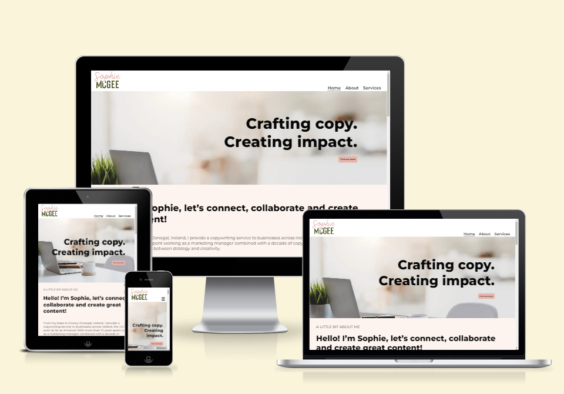
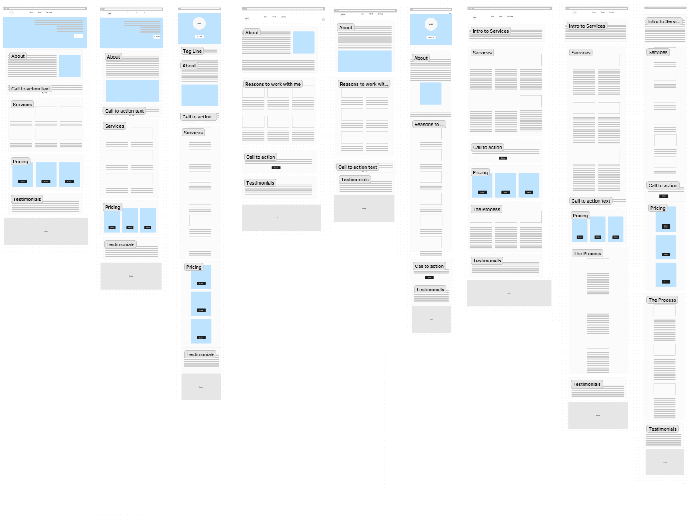
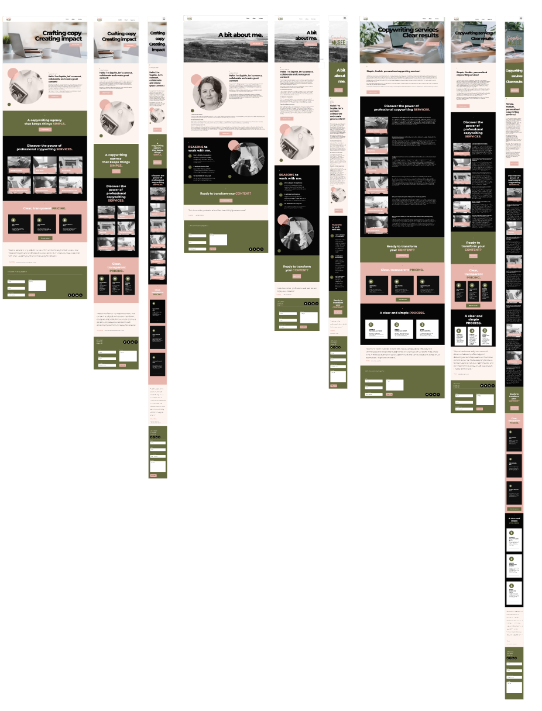
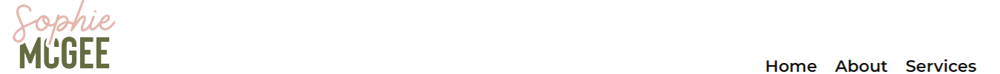
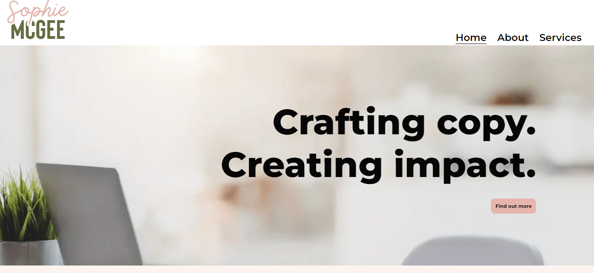
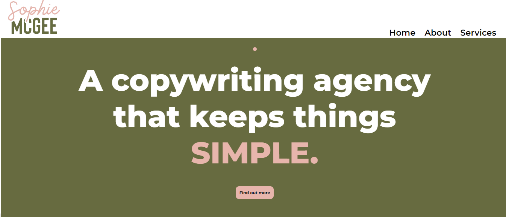

# **_Sophie McGee Copywriting - Project Portfolio 1_**

This document serves as an overview for a website I have developed using HTML and CSS. The purpose of this project is to provide an online space to highlight my expertise and advertise the copywriting services I offer, under the name of ‘Sophie McGee Copywriting’. This website is designed to provide my business with a digital presence, to help me advertise my services, and to build professional connections.

The live site can be viewed here - <a href="https://sophiemcgee.github.io/sophie-mcgee-copywriting/index.html" target="_blank" rel="noopener">Sophie McGee Copywriting</a>

# Contents

* [**Website Objectives**](<#website-objectives>)
* [**User Experience UX**](<#user-experience-ux>)
    * [**Client Background and Goals**](<#client-background-and-goals>)
    * [**Target Audience**](<#target-audience>)
    * [**User Stories**](<#user-stories>)
    * [**Market Research**](<#market-research>)
* [**Design**](<#design>)
    * [**Planning and Development**](<#planning-and-development>)
    * [**Colour Scheme and Typography**](<#colour-scheme-and-typography>)
    * [**Website Logo**](<#website-logo>)
    * [**Final Wireframes**](<#final-wireframes>)

# Website Objectives

The primary purpose is to advertise my range of services and to show my proficiency in various forms of copywriting. Whether potential clients are searching for captivating storytelling, persuasive marketing copy, or informative blog posts, they can explore my services to find the right fit for their content needs.

[Back to top](<#contents>)

# User Experience (UX)

## Client Background and Goals

As the website will be used to promote my own services, in this situation I am the client. I hold a degree in marketing and have more than 10 years of experience working as a marketing manager alongside providing copywriting services. In the past I have offered my services through gig-style platforms that are popular with freelancers, and I have also benefitted from client referrals. The goals for this website are:

* To attract new clients – I want the website to attract my target clients, with services, pricing and testimonials listed that appeal to their needs and challenges.
* Establish professionalism and credibility – The website should convey a professional and trustworthy image through a polished website design, consistent branding, and a clean layout.
* The website should clearly outline the range of copywriting services I offer, to promote my copywriting services effectively.
* It should include clear calls-to-action (CTAs) strategically placed throughout the website to encourage visitors to get in touch or enquire about my services. In addition, the website needs to provide multiple contact options, such as a contact form and social media links to make it easy for potential clients to reach out.

[Back to top](<#contents>)

## Target Audience
 
Following market research and through my own prior knowledge of my business several user types are identified including the following:

* Small business owners, startups, and entrepreneurs
* Marketing managers and their teams
* Content managers and editors
* E-commerce platforms
* Marketing agencies

[Back to top](<#contents>)

## User Stories

Based on the target audience I have defined five possible user stories:

### 1. Small Business Owners, Startups, and Entrepreneurs - exploring services for an established business or a new venture:

* As a small business owner, I want to easily navigate the website to explore the variety of copywriting services available.
* I expect to find clear and concise information about pricing based on word count, allowing me to budget effectively for my initial content needs.
* The website should showcase testimonials, helping me understand how the copywriter can tailor their services to meet the unique needs of my business.
* Clear calls-to-action for enquiries or quotes will facilitate a quick and straightforward engagement process.

### 2. Marketing Managers and their Teams - seeking a partner for marketing campaigns:

* As a marketing manager leading a campaign, I want to easily find a copywriting services section that details how the copywriter can contribute to our marketing efforts.
* Clear pricing structures will enable me to estimate costs and align them with our campaign budget.
* A streamlined process for submitting project details and requesting quotes will save time and simplify the engagement process.
* Integration with project management tools or communication platforms would be beneficial for efficient collaboration between our marketing team and the copywriter.

### 3. Content Managers and Editors - searching for high-quality website content:

* As a content manager responsible for website content, I need a user-friendly interface to specify content requirements.
* Clear communication channels, such as chat support or a dedicated contact form, will facilitate quick queries or clarifications during the content creation process.

### 4. E-Commerce Platforms - wanting to enhance product descriptions and sales copy:

* As an e-commerce platform owner, I want to explore a dedicated services section highlighting the key details relating to product descriptions.
* Clear pricing structures for product descriptions will help in estimating costs for enhancing our product pages.
* Fast turnaround times and a straightforward engagement process will be crucial for keeping our product content up-to-date and engaging.

### 5. Marketing Agencies - searching for copywriters to collaborate with on client campaigns:

* As a marketing agency seeking collaboration, I need a comprehensive overview of the copywriter's capabilities, experience and service offerings on the website.
* The website should provide flexibility in terms of tailored copywriting solutions that can be seamlessly integrated into our broader marketing strategies.
* Pricing structures should accommodate one-off and ongoing projects, allowing us to scale copywriting services for various client campaigns.
* A user-friendly interface for submitting detailed project briefs will enhance collaboration efficiency.

[Back to top](<#contents>)

## Market Research

Following the initial stages of user research for this website, comprehensive market research was conducted to not only understand the industry landscape but also to align the website with the preferences and expectations of my target clients who are looking for copywriting services on a casual, remote basis. A thorough examination of the copywriting industry provided insights into emerging trends, client preferences, and the evolving dynamics of gig-style platforms. Understanding the unique characteristics of this sector provided the insight needed to make design decisions based on the specific needs of the target clients. The following were the key areas of market research which will influence the design process:

### 1. Competitor Analysis

An in-depth analysis of competitors in both traditional copywriting and gig-style platforms was undertaken. By evaluating their pricing structures, service offerings, and client engagement models, I sought to position this website as a streamlined alternative, delivering transparent and straightforward copywriting services.
The competitor websites analysed were:
* [Stray Dog](https://www.straydog.ie/copywriter-dublin/)
* [O’Connell Copy](https://oconnellcopy.com/)
* [Bankhouse Media](https://www.bankhousemedia.ie/digital-media-services/copy-writing/)
* [SEO Agency Ireland](https://seoagencyireland.ie/copy-writing)
* [Passion for Creative](https://www.passionforcreative.com/services/marketing/copywriting/)
* [People Per Hour](https://www.peopleperhour.com/hire-freelancers/writing-translation/copywriters)
* [Upwork](https://www.upwork.com/hire/copywriters/ie/)

#### Design Implications

* The website design will emphasise simplicity and clarity, offering a clean layout that makes it easy for users to view services, the process and clear pricing.
* Visual elements will showcase these unique elements which will set this website apart from competitors.

### 2. Pricing Requirements

Given the preference for simplicity and clarity in pricing, the website which stood out in my research were designed to provide clear and concise information about pricing. This clearly aligns with the expectations of clients who appreciate a straightforward process.

#### Design Implications

* A dedicated section on both the homepage and services page on the website will clearly outline the pricing structure based on the number of words, providing transparency and facilitating easy budgeting for clients.
* Visual elements, such as pricing tables will be incorporated for an intuitive understanding of the cost implications.

### 3. Client Testimonials

Examining client testimonials and feedback within competitors websites provided valuable insights into the expectations and experiences of clients seeking copywriting services. This feedback informed decisions on how to present client testimonials on the website to resonate with the target audience.

#### Design Implications

* Testimonials from clients who I have worked with in the past will be strategically placed, emphasising the positive impact of my services.

### 4. Streamlined Contact Process

My research found that target clients have a preference for efficiency, with the ideal website designs incorporating clear contact forms for submitting copywriting requests. This combined with quick turnarounds and a user-friendly interface cater to clients need for a straightforward and time-effective transaction process.

#### Design Implications

* The website pages will feature call to action links to  guide users through to a simple contact form to submit copywriting requests, ensuring a quick and efficient experience.
* The contact form will feature in the footer of each page, ensuring it can be easily found for users scrolling on all screen sizes without having to navigate to a seperate page.

[Back to top](<#contents>)

# Design

## Planning and Development

During the development and planning phase of this website, attention to detail was paid to ensure a seamless and user-centric experience. The design process followed the five planes of UX—Strategy, Scope, Structure, Skeleton, and Surface—culminating in a website that I hope is visually appealing whilst also being intuitive, responsive, accessible.

### Strategy: Defining Goals and Objectives

In the strategy phase, the primary focus was on defining a narrative that resonates with both current clients and target audiences as defined within the user types section. The website aims to showcase key services offered, alongside highlighting my experience through client testimonials. The overall goal is to craft a persuasive narrative that highlights the power of copywriting and positions my services as the solution to potential client’s content requirements.

### Scope: Defining features and functionality

With a clear strategy in place, the scope was defined to determine the features and functionality required for an optimal user experience. This included the creation of multiple pages—Home, About, and Services — each serving a specific purpose in providing comprehensive information about my skills and services. Features such as a responsive, mobile-first design were prioritised to enhance user engagement.

### Structure: Information architecture and hierarchy

The structure plane focused on organising and arranging content to optimise user understanding and guide them towards the step of contacting me for more information. A clear and logical information architecture was implemented, ensuring that visitors can easily navigate through the website. The hierarchy of information was carefully planned from the prominent display of key information in order of priority from the services offered to pricing and testimonials on the home page, including the addition of detailed about and services pages, which all contribute to a user-friendly structure whilst encouraging visitors to engage with my contact page.

### Skeleton: Wireframing and prototyping

The skeleton phase involved wireframing and prototyping within Figma based on the decisions made during the previous planes of design. I began by creating a rough design for the website's layout and functionality, attention was given to the placement of key elements, ensuring a clean and uncluttered design, in line with the information gained during the market research. This phase also considered responsive design principles, so that the website adapts seamlessly to various screen sizes and devices.

As you can see in the the wireframes below, I was able to determine the optimal arrangement of features for a seamless user experience. The templates show the initial design ideas for three pages, the homepage, about page and services page, with each page having a desktop, tablet and mobile view planned. Within the designs I incorporated areas such as a simple navigation menu, call-to-action buttons, clear content hierarchy, text and images for visual storytelling and forms which serve the purposes of the various user types.

This wireframe is available to view in Figma via <a href="https://www.figma.com/file/AaC2sKTaflgVHGJ8yIfwwj/Sophie-McGee-Copywriter?type=whiteboard&t=HUMZ4smNbPEmjJDT-1" target="_blank" rel="noopener">THIS LINK.</a>

### Surface: Visual design and branding

The surface plane focused on the visual aspects of the website, emphasising a cohesive and visually appealing design. Consistent branding elements, including colour schemes and imagery, were carefully chosen and designed within Canva to create a professional and aesthetically pleasing user interface. Final styles can be seen in the sections below.

[Back to top](<#contents>)

## Colour Scheme and Typography

### Typography

When creating the visual identity of this project, careful consideration was given to typography to ensure a clean and cohesive design. The primary font selected is Montserrat, a versatile and modern typeface. With a sleek and contemporary appearance, Montserrat conveys professionalism and readability, making it an excellent choice for conveying information effectively.

To prioritise consistent user experience across different platforms and browsers, a sans-serif fallback option is also included. This ensures that even if Montserrat is not available, the text maintains a similar style and readability.

For headings (H1 and H2) the standard font weight of 800 provides a bold and impactful appearance to capture users attention, with the size of 2rem ideal for striking a balance between prominence and readability. As standard, the body text is also set in Montserrat for a consistent and professional look. The font size of 1.4rem provides optimal readability, making it suitable for conveying information without overwhelming the reader.

At times varying font weights and sizes have been adjusted and strategically applied, especially in elements such as buttons, icons and within media queries for larger screens to enhance visual hierarchy and user interaction. This ensures that important elements stand out, contributing to a more intuitive and user-friendly interface.

### Colour Scheme

The colour scheme selected for this project reflects a deliberate choice to evoke specific emotions, enhance readability, and establish a visually appealing interface. Each colour serves a unique purpose within the overall design, contributing to a cohesive user experience. The chosen color scheme is a result of a thoughtful blend of contrasting and complementary colours, with the dark and muted tones establishing a sophisticated atmosphere, while the softer hues infuse warmth and approachability. 

1. #060606 (Dark Charcoal):
The dark charcoal color (#060606) is used within some headings, text elements and other prominent background elements. This deep, neutral shade provides high contrast against lighter backgrounds, ensuring a clear visual hierarchy and drawing attention to critical information. The richness of this colour gives a sense of sophistication and professionalism to the design.

2. #e7b5ac (Blush Pink):
Blush pink (#e7b5ac) is utilized to infuse warmth and a touch of femininity into the colour palette, and is in line with the colours used in my overall branding. This soft and muted tone is applied to elements that require a subtle and inviting aesthetic, including section backgrounds and call to action buttons. Its inclusion adds a gentle contrast to the darker tones, creating a visually pleasing balance.

3. #676b40 (Olive Green):
Olive green (#676b40) introduces an earthy and organic element to the colour scheme. This muted green is used for various elements, contributing to a natural and grounded feel. The colour symbolises growth and harmony, creating a connection to nature within the design.

4. #fdf4ef (Cream):
Cream (#fdf4ef) serves as a background color within some section elements, providing a clean and neutral canvas for the content. This light and airy shade promotes readability and reduces eye strain, creating a comfortable reading environment. The cream colour also complements the overall warmth of the palette.

5. #a97b6c (Mauve):
Mauve (#a97b6c) is integrated to introduce a subtle accent color. This muted, dusty rose shade creates visual interest without overwhelming the overall aesthetic, and is used within a hover effect on buttons throughout the website.

[Back to top](<#contents>)

## Website Logo

Once the colour scheme was decided I created a logo for the website, which is designed to add a friendly, welcoming yet professional feel to the overall design. 

## Final Wireframes

I believe that attention to detail in the surface design stage contributes to a positive first impression and an engaging overall experience, and as this is my first website design project, I wanted to ensure I had a clear template to follow during coding. By creating the complete design and content elements within Figma I benefited from having a crucial bridge in place between conceptualising ideas and bringing them to life. At all stages of the design process I gained feedback from peers within the Code Institute and also refined ideas to enhance user experience and accessibility, so the final design differs in some places to the Figma wireframes.

The final website wireframe design is available to view in Figma via <a href="https://www.figma.com/file/dP3mcDa6YHL56k4QnIUwAD/Sophie-McGee-Copywriting-Homepage-Desktop-Design?type=design&node-id=0%3A1&mode=design&t=7bPvVV6uK0r9t8WO-1" target="_blank" rel="noopener">THIS LINK.</a>

[Back to top](<#contents>)

# Features

## Generic Website Features

### Responsive Design

The website's responsive design ensures an optimal user experience across a range of devices, from desktop computers to tablets and smartphones. This is achieved through the use of media queries, with a mobile first design these queries are set to target screens with widths of more than 768px and 996px. Features such as changing font sizes, automatic adjustment of grid layouts, images and the restyling of the footer provide adaptability that guarantees that visitors can engage seamlessly with the content, regardless of their chosen device.

### Clear Navigation

The navigation menu is thoughtfully organised at the top right of the screen where it is positioned at all times, providing easy access to the various Home, About, and Services pages. The inclusion of clear and concise labels combined with a clear hover effect ensures that users can navigate the site effortlessly, enhancing overall usability. The style is fully responsive to screen sizes and a responsive navigation bar appears for use with mobile devices on screens less than 768px wide. In addition, the logo is included in the left of the navigation bar and can be clicked to take users back to the home page to enhance user experience.

Desktop Navigation Bar:

Mobile Navigation Bar:

### Hero Section

The hero sections on each page are design to captivate visitors with a high-quality image paired with compelling copy. This impactful combination immediately communicates the overall brand identity and encourages users to explore further with a call-to-action button.

Hero View on Homepage:

### Call-to-Action Buttons:

Throughout the website I have used strategically placed call-to-action buttons which are designed to guide users to the contact form, which is positioned in the website footer. Using text such as "Find out more" and "Discover more" buttons encourages visitors to use the contact form, fostering engagement and conversion. These buttons feature a hover effect, so the colour of the button darkens when a user hovers or clicks on the button.

Call-to-action button:

## Homepage Features

## About Page Features

## Service Page Features

