# **_Sophie McGee Copywriting - Project Portfolio 1_**

This document serves as an overview for a website I have developed using HTML and CSS. The purpose of this project is to provide an online space to highlight my expertise and advertise the copywriting services I offer, under the name of ‘Sophie McGee Copywriting’. This website is designed to provide my business with a digital presence, to help me advertise my services, and to build professional connections.

The live site can be viewed here - <a href="https://sophiemcgee.github.io/sophie-mcgee-copywriting/index.html" target="_blank" rel="noopener">Sophie McGee Copywriting</a>

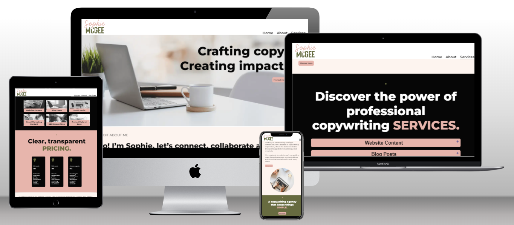

# Contents

* [**Website Objectives**](<#website-objectives>)
* [**User Experience UX**](<#user-experience-ux>)
    * [**Client Background and Goals**](<#client-background-and-goals>)
    * [**Target Audience**](<#target-audience>)
    * [**User Stories**](<#user-stories>)
    * [**Market Research**](<#market-research>)
        * [Competitor Analysis](<#competitor-analysis>)
        * [Pricing Requirements](<#pricing-requirements>)
        * [Client Testimonials](<#client-testimonials>)
        * [Streamlined Contact Process](<#streamlined-contact-process>)
* [**Design**](<#design>)
    * [**Planning and Development**](<#planning-and-development>)
        * [Strategy](<#strategy>)
        * [Scope](<#scope>)
        * [Structure](<#structure>)
        * [Skeleton](<#skeleton>)
        * [Surface](<#surface>)
    * [**Colour Scheme and Typography**](<#colour-scheme-and-typography>)
        * [Typography](<#typography>)
        * [Colour Scheme](<#colour-scheme>)
    * [**Website Logo**](<#website-logo>)
    * [**Final Wireframes**](<#final-wireframes>)
* [**Features**](<#features>)
    * [**Generic Website Features**](<#generic-website-features>)
        * [Responsive Design](<#responsive-design>)
        * [Clear Navigation](<#clear-navigation>)
        * [Hero Section](<#hero-section>)
        * [Call-to-Action Buttons](<#call-to-action-buttons>)
        * [Favicon](<#favicon>)
        * [Footer](<#Footer>)
        * [Testimonials](<#testimonials>)
        * [404 Page](<#404-page>)
        * [Contact Page](<#contact-page>)
    * [**Homepage Features**](<#homepage-features>)
        * [About Section](<#about-section>)
        * [Services Section](<#services-section>)
        * [Pricing Section](<#pricing-section>)
    * [**About Page Features**](<#about-page-features>)
        * [Main About Section](<#main-about-section>)
        * [Reasons to Work With Me Section](<#reasons-to-work-with-me-section>)
    * [**Service Page Features**](<#service-page-features>)
        * [Introduction Section](<#introduction-section>)
        * [Main Services Section](<#main-services-section>)
        * [Process Section](<#process-section>)
     * [**Future Features**](<#future-features>)
        * [Portfolio Page](<#portfolio-page>)
        * [Content Request Form](<#content-request-form>)
        * [Client Dashboard and Integration](<#client-dashboard-and-integration>)
        * [Blog Page](<#blog-page>)
* [**Technologies Used**](<#technologies-used>)
* [**Deployment**](<#deployment>)
    * [**Opening the repository**](<#opening-the-repository>)
    * [**Forking the repository**](<#forking-the-repository>)
    * [**Cloning the repository**](<#cloning-the-repository>)

# Website Objectives

The primary purpose is to advertise my range of services and to show my proficiency in various forms of copywriting. Whether potential clients are searching for captivating storytelling, persuasive marketing copy, or informative blog posts, they can explore my services to find the right fit for their content needs.

[Back to top](<#contents>)

# User Experience (UX)

## Client Background and Goals

As the website will be used to promote my own services, in this situation I am the client. I hold a degree in marketing and have more than 10 years of experience working as a marketing manager alongside providing copywriting services. In the past I have offered my services through gig-style platforms that are popular with freelancers, and I have also benefitted from client referrals. The goals for this website are:

* To attract new clients – I want the website to attract my target clients, with services, pricing and testimonials listed that appeal to their needs and challenges.
* Establish professionalism and credibility – The website should convey a professional and trustworthy image through a polished website design, consistent branding, and a clean layout.
* The website should clearly outline the range of copywriting services I offer, to promote my copywriting services effectively.
* It should include clear calls-to-action (CTAs) strategically placed throughout the website to encourage visitors to get in touch or enquire about my services. In addition, the website needs to provide multiple contact options, such as a contact form and social media links to make it easy for potential clients to reach out.

[Back to top](<#contents>)

## Target Audience
 
Following market research and through my own prior knowledge of my business several user types are identified including the following:

* Small business owners, startups, and entrepreneurs
* Marketing managers and their teams
* Content managers and editors
* E-commerce platforms
* Marketing agencies

[Back to top](<#contents>)

## User Stories

Based on the target audience I have defined five possible user stories:

### 1. Small Business Owners, Startups, and Entrepreneurs - exploring services for an established business or a new venture:

* As a small business owner, I want to easily navigate the website to explore the variety of copywriting services available.
* I expect to find clear and concise information about pricing based on word count, allowing me to budget effectively for my initial content needs.
* The website should showcase testimonials, helping me understand how the copywriter can tailor their services to meet the unique needs of my business.
* Clear calls-to-action for enquiries or quotes will facilitate a quick and straightforward engagement process.

### 2. Marketing Managers and their Teams - seeking a partner for marketing campaigns:

* As a marketing manager leading a campaign, I want to easily find a copywriting services section that details how the copywriter can contribute to our marketing efforts.
* Clear pricing structures will enable me to estimate costs and align them with our campaign budget.
* A streamlined process for submitting project details and requesting quotes will save time and simplify the engagement process.
* Integration with project management tools or communication platforms would be beneficial for efficient collaboration between our marketing team and the copywriter.

### 3. Content Managers and Editors - searching for high-quality website content:

* As a content manager responsible for website content, I need a user-friendly interface to specify content requirements.
* Clear communication channels, such as chat support or a dedicated contact form, will facilitate quick queries or clarifications during the content creation process.

### 4. E-Commerce Platforms - wanting to enhance product descriptions and sales copy:

* As an e-commerce platform owner, I want to explore a dedicated services section highlighting the key details relating to product descriptions.
* Clear pricing structures for product descriptions will help in estimating costs for enhancing our product pages.
* Fast turnaround times and a straightforward engagement process will be crucial for keeping our product content up-to-date and engaging.

### 5. Marketing Agencies - searching for copywriters to collaborate with on client campaigns:

* As a marketing agency seeking collaboration, I need a comprehensive overview of the copywriter's capabilities, experience and service offerings on the website.
* The website should provide flexibility in terms of tailored copywriting solutions that can be seamlessly integrated into our broader marketing strategies.
* Pricing structures should accommodate one-off and ongoing projects, allowing us to scale copywriting services for various client campaigns.
* A user-friendly interface for submitting detailed project briefs will enhance collaboration efficiency.

[Back to top](<#contents>)

## Market Research

Following the initial stages of user research for this website, comprehensive market research was conducted to not only understand the industry landscape but also to align the website with the preferences and expectations of my target clients who are looking for copywriting services on a casual, remote basis. A thorough examination of the copywriting industry provided insights into emerging trends, client preferences, and the evolving dynamics of gig-style platforms. Understanding the unique characteristics of this sector provided the insight needed to make design decisions based on the specific needs of the target clients. The following were the key areas of market research which will influence the design process:

### Competitor Analysis

An in-depth analysis of competitors in both traditional copywriting and gig-style platforms was undertaken. By evaluating their pricing structures, service offerings, and client engagement models, I sought to position this website as a streamlined alternative, delivering transparent and straightforward copywriting services.
The competitor websites analysed were:
* [Stray Dog](https://www.straydog.ie/copywriter-dublin/)
* [O’Connell Copy](https://oconnellcopy.com/)
* [Bankhouse Media](https://www.bankhousemedia.ie/digital-media-services/copy-writing/)
* [SEO Agency Ireland](https://seoagencyireland.ie/copy-writing)
* [Passion for Creative](https://www.passionforcreative.com/services/marketing/copywriting/)
* [People Per Hour](https://www.peopleperhour.com/hire-freelancers/writing-translation/copywriters)
* [Upwork](https://www.upwork.com/hire/copywriters/ie/)

#### Design Implications

* The website design will emphasise simplicity and clarity, offering a clean layout that makes it easy for users to view services, the process and clear pricing.
* Visual elements will showcase these unique elements which will set this website apart from competitors.

### Pricing Requirements

Given the preference for simplicity and clarity in pricing, the website which stood out in my research were designed to provide clear and concise information about pricing. This clearly aligns with the expectations of clients who appreciate a straightforward process.

#### Design Implications

* A dedicated section on both the homepage and services page on the website will clearly outline the pricing structure based on the number of words, providing transparency and facilitating easy budgeting for clients.
* Visual elements, such as pricing tables will be incorporated for an intuitive understanding of the cost implications.

### Client Testimonials

Examining client testimonials and feedback within competitors websites provided valuable insights into the expectations and experiences of clients seeking copywriting services. This feedback informed decisions on how to present client testimonials on the website to resonate with the target audience.

#### Design Implications

* Testimonials from clients who I have worked with in the past will be strategically placed, emphasising the positive impact of my services.

### Streamlined Contact Process

My research found that target clients have a preference for efficiency, with the ideal website designs incorporating clear contact forms for submitting copywriting requests. This combined with quick turnarounds and a user-friendly interface cater to clients need for a straightforward and time-effective transaction process.

#### Design Implications

* The website pages will feature call to action links to  guide users through to a simple contact form to submit copywriting requests, ensuring a quick and efficient experience.
* The contact form will feature in the footer of each page, ensuring it can be easily found for users scrolling on all screen sizes without having to navigate to a seperate page.

[Back to top](<#contents>)

# Design

## Planning and Development

During the development and planning phase of this website, attention to detail was paid to ensure a seamless and user-centric experience. The design process followed the five planes of UX—Strategy, Scope, Structure, Skeleton, and Surface—culminating in a website that I hope is visually appealing whilst also being intuitive, responsive, accessible.

### Strategy

In the strategy phase, the primary focus was on defining a narrative that resonates with both current clients and target audiences as defined within the user types section. The website aims to showcase key services offered, alongside highlighting my experience through client testimonials. The overall goal is to craft a persuasive narrative that highlights the power of copywriting and positions my services as the solution to potential client’s content requirements.

### Scope

With a clear strategy in place, the scope was defined to determine the features and functionality required for an optimal user experience. This included the creation of multiple pages—Home, About, and Services — each serving a specific purpose in providing comprehensive information about my skills and services. Features such as a responsive, mobile-first design were prioritised to enhance user engagement.

### Structure

The structure plane focused on organising and arranging content to optimise user understanding and guide them towards the step of contacting me for more information. A clear and logical information architecture was implemented, ensuring that visitors can easily navigate through the website. The hierarchy of information was carefully planned from the prominent display of key information in order of priority from the services offered to pricing and testimonials on the home page, including the addition of detailed about and services pages, which all contribute to a user-friendly structure whilst encouraging visitors to engage with my contact page.

### Skeleton

The skeleton phase involved wireframing and prototyping within Figma based on the decisions made during the previous planes of design. I began by creating a rough design for the website's layout and functionality, attention was given to the placement of key elements, ensuring a clean and uncluttered design, in line with the information gained during the market research. This phase also considered responsive design principles, so that the website adapts seamlessly to various screen sizes and devices.

As you can see in the the wireframes below, I was able to determine the optimal arrangement of features for a seamless user experience. The templates show the initial design ideas for three pages, the homepage, about page and services page, with each page having a desktop, tablet and mobile view planned. Within the designs I incorporated areas such as a simple navigation menu, call-to-action buttons, clear content hierarchy, text and images for visual storytelling and forms which serve the purposes of the various user types.

This wireframe is available to view in Figma via <a href="https://www.figma.com/file/AaC2sKTaflgVHGJ8yIfwwj/Sophie-McGee-Copywriter?type=whiteboard&t=HUMZ4smNbPEmjJDT-1" target="_blank" rel="noopener">THIS LINK.</a>

### Surface

The surface plane focused on the visual aspects of the website, emphasising a cohesive and visually appealing design. Consistent branding elements, including colour schemes and imagery, were carefully chosen and designed within Canva to create a professional and aesthetically pleasing user interface. Final styles can be seen in the sections below.

[Back to top](<#contents>)

## Colour Scheme and Typography

### Typography

When creating the visual identity of this project, careful consideration was given to typography to ensure a clean and cohesive design. The primary font selected is Montserrat, a versatile and modern typeface. With a sleek and contemporary appearance, Montserrat conveys professionalism and readability, making it an excellent choice for conveying information effectively. This font was imported from Google Fonts.

To prioritise consistent user experience across different platforms and browsers, a sans-serif fallback option is also included. This ensures that even if Montserrat is not available, the text maintains a similar style and readability.

For headings (H1 and H2) the standard font weight of 800 provides a bold and impactful appearance to capture users attention, with the size of 2rem ideal for striking a balance between prominence and readability. As standard, the body text is also set in Montserrat for a consistent and professional look. The font size of 1.4rem provides optimal readability, making it suitable for conveying information without overwhelming the reader.

At times varying font weights and sizes have been adjusted and strategically applied, especially in elements such as buttons, icons and within media queries for larger screens to enhance visual hierarchy and user interaction. This ensures that important elements stand out, contributing to a more intuitive and user-friendly interface.

### Colour Scheme

The colour scheme selected for this project reflects a deliberate choice to evoke specific emotions, enhance readability, and establish a visually appealing interface. Each colour serves a unique purpose within the overall design, contributing to a cohesive user experience. The chosen color scheme is a result of a thoughtful blend of contrasting and complementary colours, with the dark and muted tones establishing a sophisticated atmosphere, while the softer hues infuse warmth and approachability. 

1. #060606 (Dark Charcoal):
The dark charcoal color (#060606) is used within some headings, text elements and other prominent background elements. This deep, neutral shade provides high contrast against lighter backgrounds, ensuring a clear visual hierarchy and drawing attention to critical information. The richness of this colour gives a sense of sophistication and professionalism to the design.

2. #e7b5ac (Blush Pink):
Blush pink (#e7b5ac) is utilized to infuse warmth and a touch of femininity into the colour palette, and is in line with the colours used in my overall branding. This soft and muted tone is applied to elements that require a subtle and inviting aesthetic, including section backgrounds and call to action buttons. Its inclusion adds a gentle contrast to the darker tones, creating a visually pleasing balance.

3. #676b40 (Olive Green):
Olive green (#676b40) introduces an earthy and organic element to the colour scheme. This muted green is used for various elements, contributing to a natural and grounded feel. The colour symbolises growth and harmony, creating a connection to nature within the design.

4. #fdf4ef (Cream):
Cream (#fdf4ef) serves as a background color within some section elements, providing a clean and neutral canvas for the content. This light and airy shade promotes readability and reduces eye strain, creating a comfortable reading environment. The cream colour also complements the overall warmth of the palette.

5. #a97b6c (Mauve):
Mauve (#a97b6c) is integrated to introduce a subtle accent color. This muted, dusty rose shade creates visual interest without overwhelming the overall aesthetic, and is used within a hover effect on buttons throughout the website.

[Back to top](<#contents>)

## Website Logo

Once the colour scheme was decided I created a logo for the website, which is designed to add a friendly, welcoming yet professional feel to the overall design. 

## Final Wireframes

I believe that attention to detail in the surface design stage contributes to a positive first impression and an engaging overall experience, and as this is my first website design project, I wanted to ensure I had a clear template to follow during coding. By creating the complete design and content elements within Figma I benefited from having a crucial bridge in place between conceptualising ideas and bringing them to life. At all stages of the design process I gained feedback from peers within the Code Institute and also refined ideas to enhance user experience and accessibility, so the final design differs in some places to the Figma wireframes.

The final website wireframe design is available to view in Figma via <a href="https://www.figma.com/file/dP3mcDa6YHL56k4QnIUwAD/Sophie-McGee-Copywriting-Homepage-Desktop-Design?type=design&node-id=0%3A1&mode=design&t=7bPvVV6uK0r9t8WO-1" target="_blank" rel="noopener">THIS LINK.</a>

As you can see from the wireframes, the structure of the website features three pages, the homepage, an about page and a services page. The design and overall structure was built based on the research outlined above.

[Back to top](<#contents>)

# Features

## Generic Website Features

### Responsive Design

The website's responsive design ensures an optimal user experience across a range of devices, from desktop computers to tablets and smartphones. This is achieved through the use of media queries, with a mobile first design these queries are set to target screens with widths of more than 768px and 996px. Features such as changing font sizes, automatic adjustment of grid layouts, images and the restyling of the footer provide adaptability that guarantees that visitors can engage seamlessly with the content, regardless of their chosen device.

### Clear Navigation

The navigation menu is thoughtfully organised at the top right of the screen where it is positioned at all times, providing easy access to the various Home, About, and Services pages. The inclusion of clear and concise labels combined with a clear hover effect ensures that users can navigate the site effortlessly, enhancing overall usability. The style is fully responsive to screen sizes and a responsive navigation bar appears for use with mobile devices on screens less than 768px wide. In addition, the logo is included in the left of the navigation bar and can be clicked to take users back to the home page to enhance user experience.

Desktop Navigation Bar:

Mobile Navigation Bar:

### Hero Section

The hero sections on each page are design to captivate visitors with a high-quality image paired with compelling copy. This impactful combination immediately communicates the overall brand identity and encourages users to explore further with a call-to-action button.

Hero View on Homepage:

### Call-to-Action Buttons:

Throughout the website I have used strategically placed call-to-action buttons which are designed to guide users to the contact form, which is positioned in the website footer. Using text such as "Find out more" and "Discover more" buttons encourages visitors to use the contact form, fostering engagement and conversion. These buttons feature a hover effect, so the colour of the button darkens when a user hovers or clicks on the button.

Call-to-Action Button:

### Favicon

A custom favicon featuring the logo adds a professional touch to the website. This small but impactful visual element contributes to brand recognition, even when users have multiple tabs open.

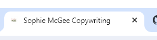

### Footer

The footer which features across all pages incorporates three key sections, the contact form, social media links and the website logo image. The logo image is designed to appear on screensizes above 996px wide as it fills a space in the footer design, when clicked the user is taken to the top of the main homepage to enhance user experience.

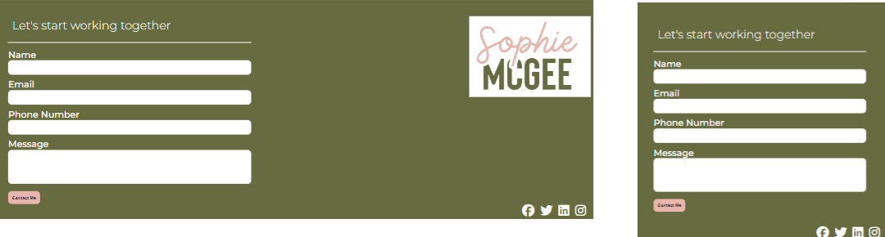

#### Social Media Integration

Social media icons from Font Awesome are included in the footer with links to Facebook, Twitter, LinkedIn, and Instagram, with the code set to open new pages for each. This integration encourages visitors to connect with the brand on various platforms, fostering a broader online presence and community engagement. At the moment there are no social media pages for the business, so the links take users to the various social media homepages.

#### Contact Form

The footer features a user-friendly contact form, inviting visitors to initiate direct communication. Fields for name, email, phone number, and a message ensure that potential clients can easily reach out, streamlining the enquiry process, with each field having the following type:

1. First Name (required, type=text)
1. Last Name (required, type=text)
1. Email (required, type=email)
1. Message (required, type=textarea)

As this is a test website, upon submission of this form a user is sent to a contact page.

There are call-to-actions buttons throughout the website pages which link to this contact form.

### Testimonials

The testimonials section is featured on the main homepage, about page and services page with each page showcasing positive feedback from a satisfied client, adding credibility and building trust. Real-life testimonials offer potential clients insights into the quality of your work and the positive impact of my copywriting services.

### 404 Page

A 404 page has been included which will display if a user navigates to a broken URL. The page is designed to include a button with a link back to the main homepage, and the inclusion of the footer provides continuity of design whilst still allowing users to send a message.

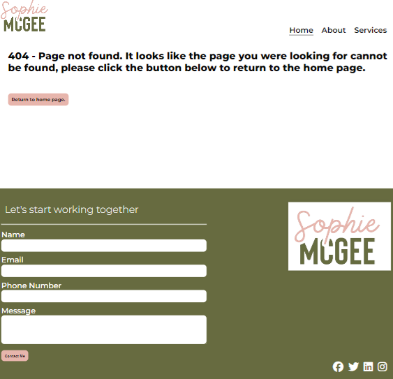

### Contact Page

As this is a test project I have designed a page which is displayed when a user enters information into the contact form. This ensures that the users are aware that the data entered has not been sent or stored anywhere. In the same way as the 404 page, there is a link to the homepage and the standard website footer. 

[Back to top](<#contents>)

## Homepage Features

In addition to the generic features outlined above, the main homepage of the website is designed with the following features:

### About Section

The "About" section offers a personal touch, introducing me as a skilled copywriter. The combination of textual storytelling and visual elements, including a circlular image on smaller screens, creates a compelling narrative that resonates with visitors. This image is designed to disappear on screens above 768px wide, as other visual elements help to divide the sections of text. A call-to-action button is featured within this section which directs users to the main about page, with both the small and larger screen views shown below:

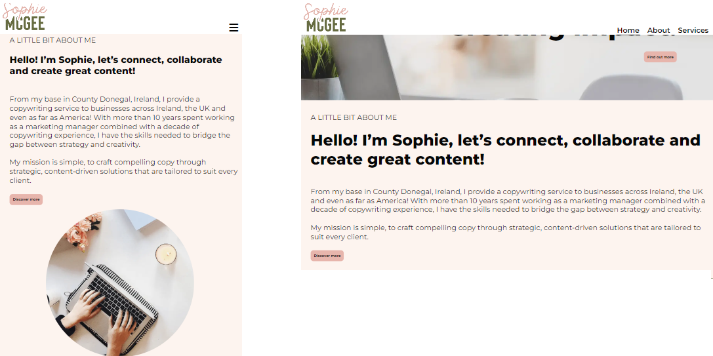

### Services Section

The "Services" section features a compelling header and presents a visually appealing grid layout with enticing images and concise labels for each service, with a fully responsive design. This design choice ensures that visitors can quickly understand the breadth of my services, and a transform effect has been added to each image to encourage users to click the image to be forwarded to the main services section within the services page. The grid is designed to adjust to varying screen sizes as shown below:

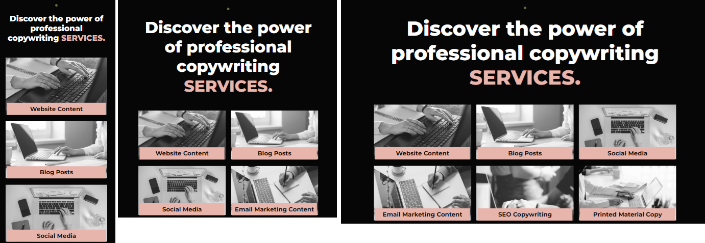

### Pricing Section

The "Pricing" section provides transparent and straightforward options for clients. Three pricing tiers are outlined, featuring word count and corresponding costs. These options include 500 words for €30, 1000 words for €50, and Custom requests with Price on Application (POA). Brief descriptions accompany each pricing tier, ensuring clarity and enabling clients to make informed decisions. The grid layout enhances the simplicity of the section and is designed to adjust to suit varying screen sizes as shown below:

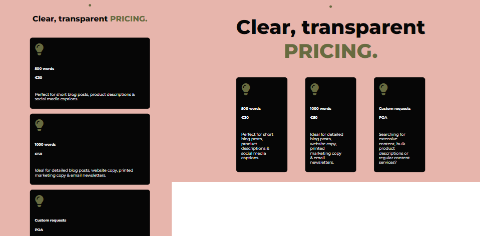

[Back to top](<#contents>)

## About Page Features

In addition to the generic features outlined above, the about page of the website is designed with the following features:

### Main About Section

The main "About" section builds upon the about section within the main homepage and uses the same combination of textual storytelling and visual elements. This includes the replication of the circlular image on smaller screens, which is designed to disappear on screens above 768px wide. A call-to-action button is featured within this section which directs users to the contact form within the footer. The full text view on screens above 768px can be seen below:

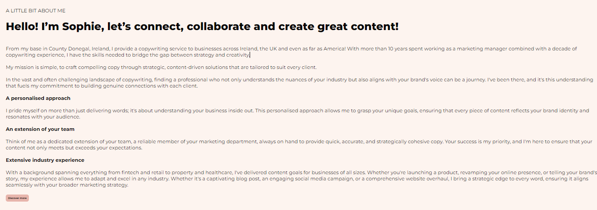

### Reasons to Work With Me Section

The "Reasons to Work With Me" section provides insights into my experience with each reason presented with a distinct icon, contributing to a visually engaging layout. This section aims to communicate my unique expertise and dedication to my clients and builds upon the content within the section above in a simple and eye-catching way. To continue the styling from the section above a circlular image with the same dimensions is designed to appear on smaller screens below 996px wide, as shown below. As this section includes less text than the section above, the image is kept in place for longer.

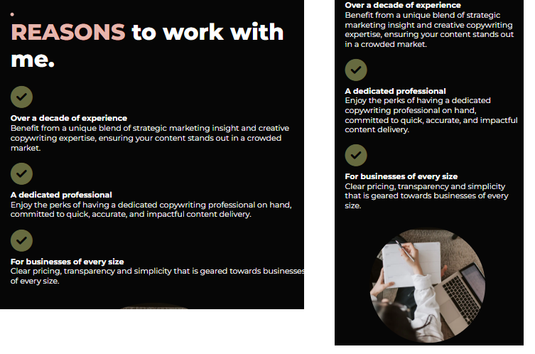

[Back to top](<#contents>)

## Service Page Features

In addition to the generic features outlined above, the services page of the website is designed with the following features:

### Introduction Section

The "Services Intro" section offers a concise overview, presenting the copywriting services as simple, flexible, and personalised. The styling is similar to the sections included below the hero image in other pages, which creates cohesion and familiarity for users. A call-to-action button is included that links to the contact form in the footer, as shown below:

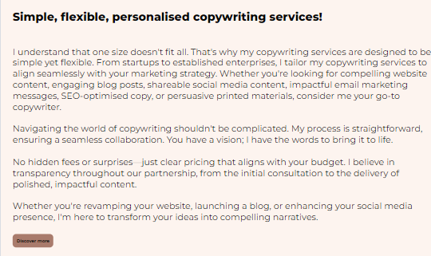

### Main Services Section

The Services section features an accordion-style layout for the various copywriting services offered. Link from each of the homepage services takes users to this section, making it quick and easy for users to find the service they need. The accordion features a hover effect and pointing cursor alongside '+' and '-' icons, which clearly show users they can click the various headings to view the contect for each. As shown in the image below:

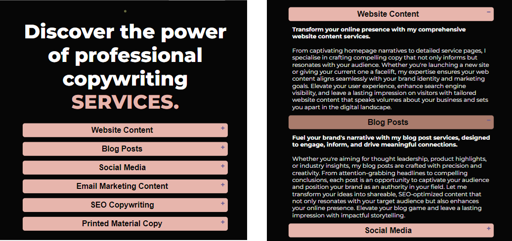

### Process Section

To further display the simplicity of the service a section is included with a clear three-step process: Connect, Create and Share. The styling carries through from the pricing grid layout for cohesion, and is designed to adjust to various screen sizes in the same way, as shown below: 

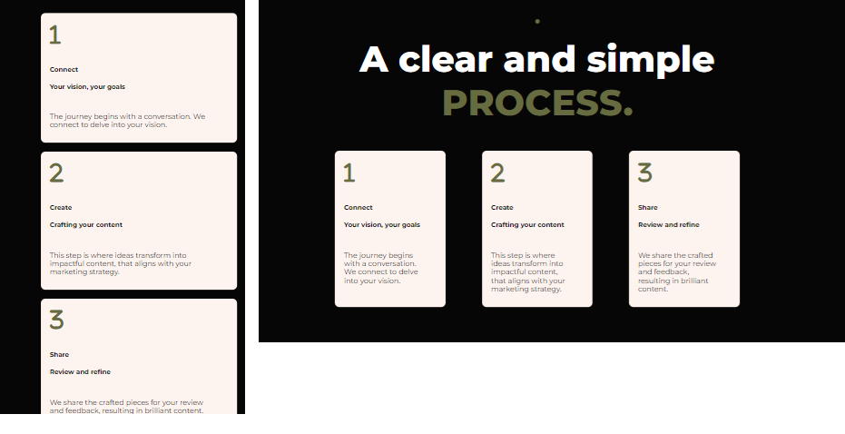

[Back to top](<#contents>)

## Future Features

The current website design serves as a starting point, with the following features planned to elevate the user experience in line with the information gained during research and project development.

### Portfolio page

A portfolio showcase page that includes detailed case studies and example projects will help to provide potential clients with further insight to the services available.

### Content request form

A detailed content request form will allow clients to order content based on the standard pricing listed on the website. This will streamline the process further and help to increase conversion rates.

### Client dashboard and integration

A fully integrated client dashboard will provide clients with the ability to track project progress, provide feedback and download content. This will enhance communication and ensure the workflow is efficient and transparent at all points within the copywriting process.

### Blog page

A blog page will feature regular updates on projects, industry developments and useful copywriting tips. This will provide potential clients with extra information whilst also helping to build relationships.

# Technologies Used

* HTML
    * This coding language was used to provide the foundation of the website’s structure and content.
* CSS
    * To provide styling to enhance the visual appearance and user experience custom CSS was applied via an external file.
*Javascript
    * Javascript code was used within the accordion section of the services page to provide the button functionality.
* Gitpod
    * This IDE was used during the coding and project management phase.
* Github
    * All code was pushed to Github which is used to host the projects code.
* Canva
    * This online design tool was used to design the website logo, to source images, to compare and find the font and to choose colours for the overall colour scheme.
*Favicon.io
    * The favicon was created for this website
*Figma
    * Both the initial basic wireframes and the final wireframe designs were built using Figma.
*Tinypng
    * This website was used to reduce file size through compression for images throughout the website. They were also changed to a .webp format where possible to improve performance.
*Font Awesome
    * The icons used throughout the website were sourced and downloaded from the Font Awesome website.
*Google Fonts
    * The Montserrat font used throughout the website was added to the CSS stylesheet via the Google Fonts website.

[Back to top](<#contents>)

# Deployment

The website was created using GitPod and is deployed to the GitHub repository 'sophie-mcgee-copywriting'.

During the coding stage all changes were pushed to Github with relevant commit messages to track development progress.

## Opening the repository

The website can be deployed within Github by following these steps:

1. Open the Github repository via this <a href="https://github.com/SophieMcGee/sophie-mcgee-copywriting" target="_blank" rel="noopener">LINK.</a>
2. Open the 'Settings' tab.
3. Click the 'Pages' tab within the menu to the left of the page.
4. A link to view the live website will be displayed at the top of the page, it can take up to 5 minutes to deploy.

This is the live link: https://sophiemcgee.github.io/sophie-mcgee-copywriting/

## Forking the repository

1. Open the Github repository and navigate to the 'Code' tab.
2. To the right of the screen click the 'Fork' button.

## Cloning the repository

1. Open the Github repository and navigate to the 'Code' tab.
2. To the right of the main screen click the green 'Code' button.
3. Ensure HTTPS is selected and click the button to copy the URL to the clipboard.
4. Open Gitpod (or an IDE with Git installed) and type in the terminal: git clone (INSERT COPIED LINK HERE)

[Back to top](<#contents>)

# Testing

Comprehensive testing of the website was conducted to ensure the functionality of individual components throughout each page of the site. 

## Validator Testing

The following websites were used during the testing process to check for errors within the code for all pages:

* <a href="https://validator.w3.org/" target="_blank" rel="noopener">W3C Markup Validation Service</a>
* <a href="https://jigsaw.w3.org/css-validator/" target="_blank" rel="noopener">W3C CSS Validation Service</a>

The results were as follows:

### HTML Validation:

* Homepage

Inital Test:

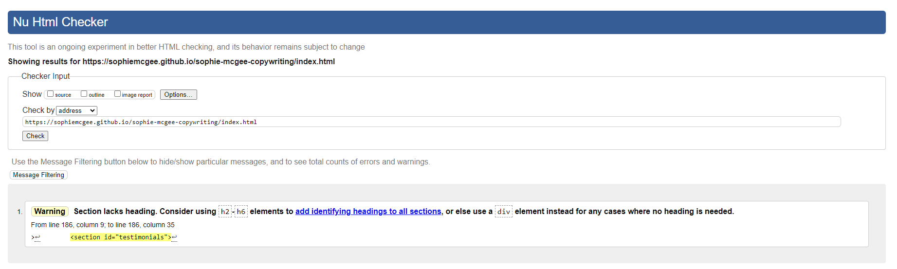

Amendments:

The tool recommended adding a heading to the testimonials section, which in this case is not neccessary. The issue has been fixed by changing the <section> to a 
.

Final Test:

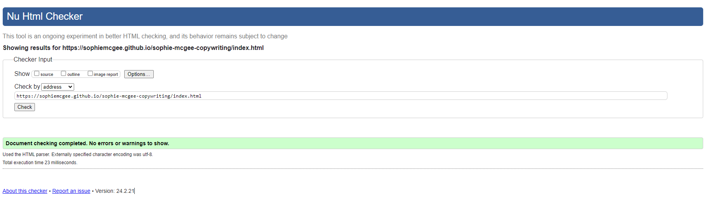

* About Page

Inital Test:

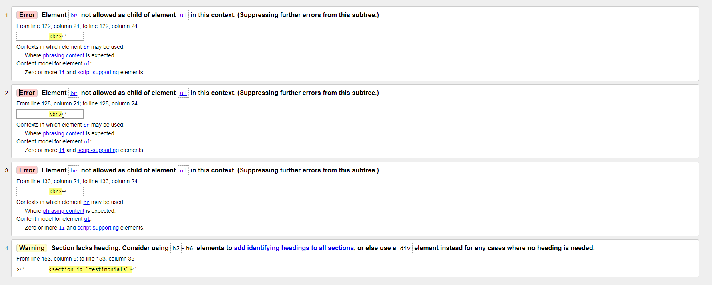

Amendments:

The tool found an issue within the reasons section where   elements were used as children of a <ul> element, the issue has been fixed by removing these elements and adding a margin to the icon instead. In addition the tool recommended adding a heading to the testimonials section, which in this case is not neccessary. The issue has been fixed by changing the <section> to a 
.

Final Test:

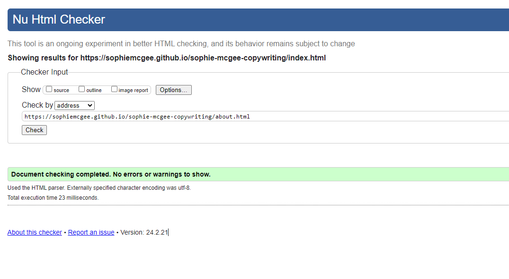

* Services Page

Inital Test:

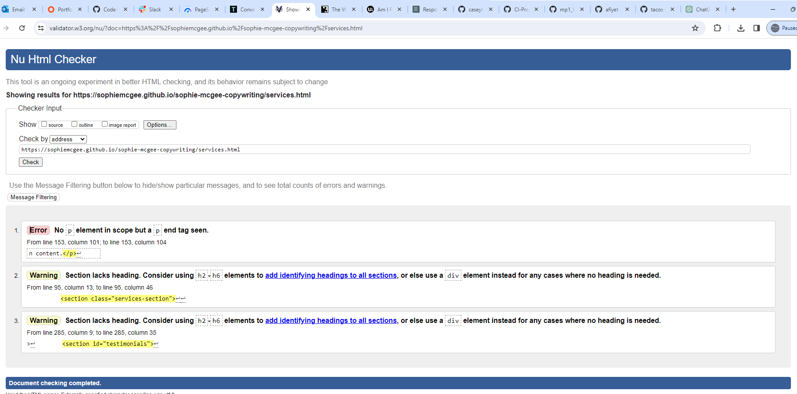

Amendments:

The tool found an issue with a duplicated 
 within the email marketing section of the services accordion, this has been fixed by removing the duplication. The next issues related to recommendations for heading tags within sections, however this was not relevant and the code has been fixed by changing the <section> element to 
 elements.

Final Test:

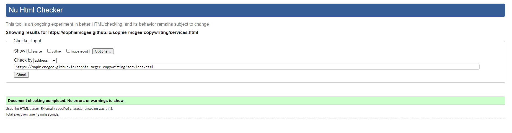

* 404 Page

Inital Test:

Amendments:

No issues were found.

* Contact Page

Inital Test:

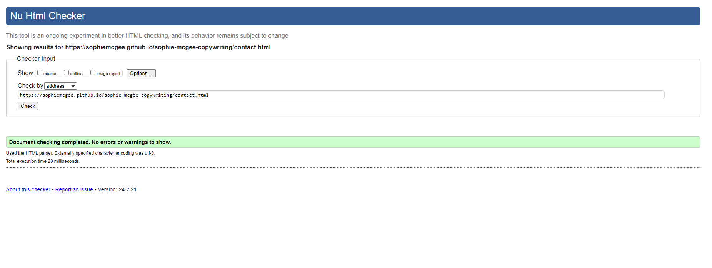

Amendments:

No issues were found.

[Back to top](<#contents>

### CSS Validation

Inital Test:

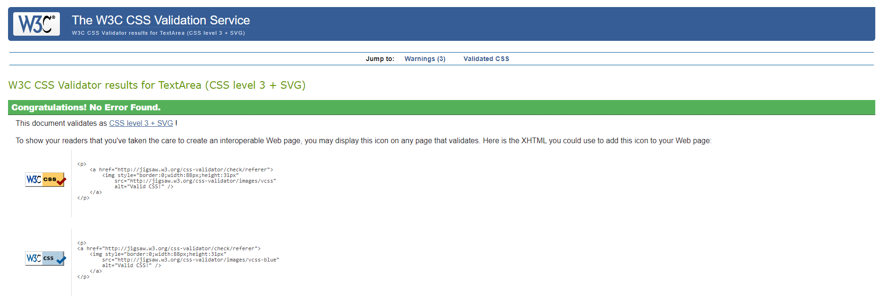

Amendments:

No issues were found.

[Back to top](<#contents>

## Responsivity Testing

The pages within the website were tested for responsivity throughout the design process using Chrome Dev Tools. At the end of the project each page was tested using the <a href="http://www.responsinator.com" target="_blank" rel="noopener">Responsinator</a> website. The testing shows that all pages are responsive from 280 pixels and upwards, within the Chrome, Firefox, Edge and Opera browsers. There  is no stretching, pixelation or horizontal scroll and all elements are positioned as outlined within the CSS stylesheet.

The results of all testing including the screen sizes tested are shown below:

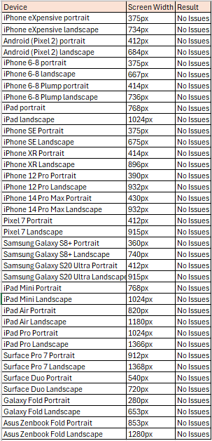

To test the responsiveness of a page within this website follow these steps:

1. Open the website URL.
2. Open the developer tools window.
3. Set the zoom to 50% and choose the 'Responsive' tab.
4. The screen width can be adjusted to various sizes to view how the page responds.

## Performance Testing

<a href="https://pagespeed.web.dev/" target="_blank" rel="noopener">PageSpeed Insights</a> was used to test several performance related areas including; performance, accessibility, best practices, SEO and progressive web app. The results are shown below for both mobile and desktop views.
### Homepage

*Mobile View:

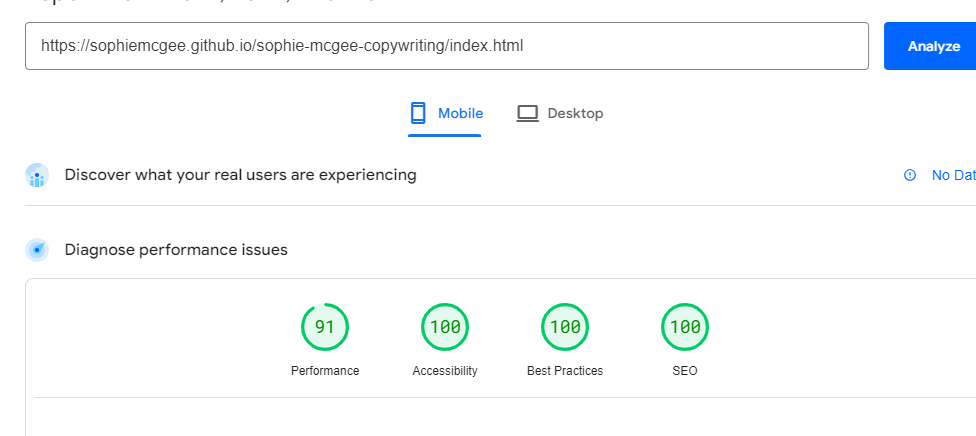

*Desktop View:

### About Page

*Mobile View:

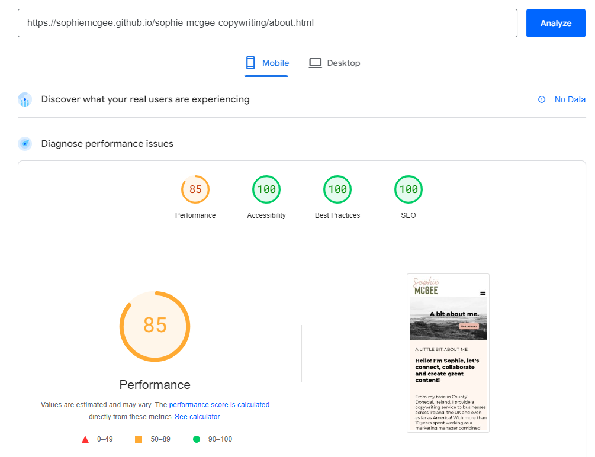

*Desktop View:

### Services Page

*Mobile View:

*Desktop View:

### 404 Page

*Mobile View:

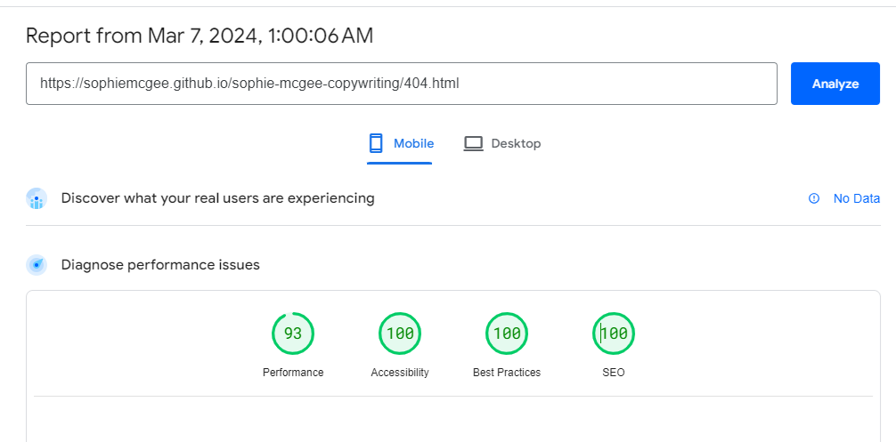

*Desktop View:

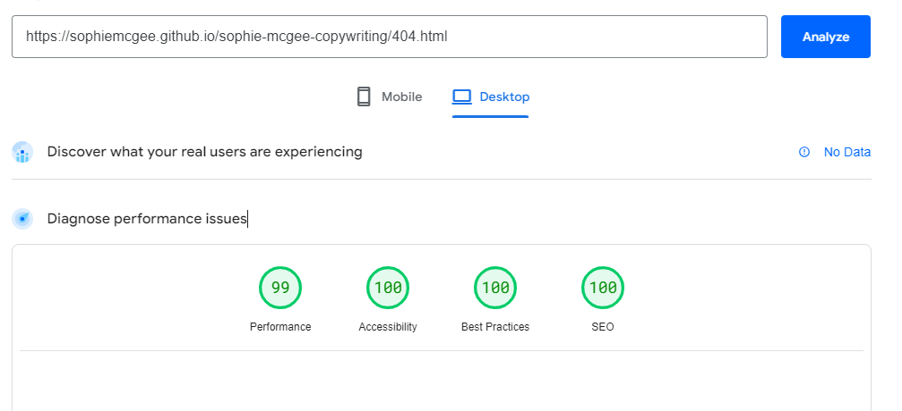

### Contact Page

*Mobile View:

*Desktop View:

## Testing of Website Functions

## Bugs

